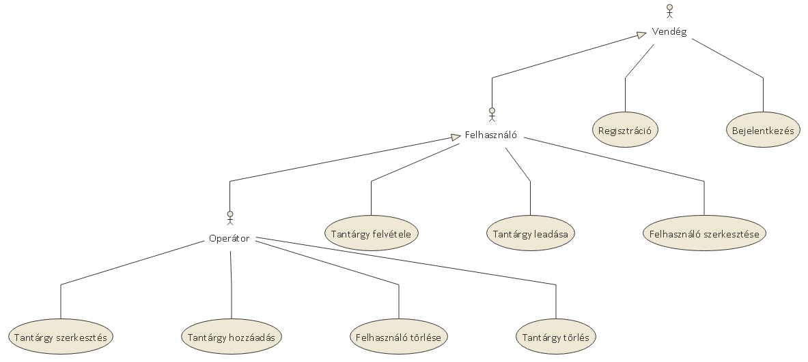
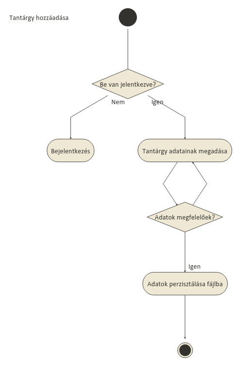
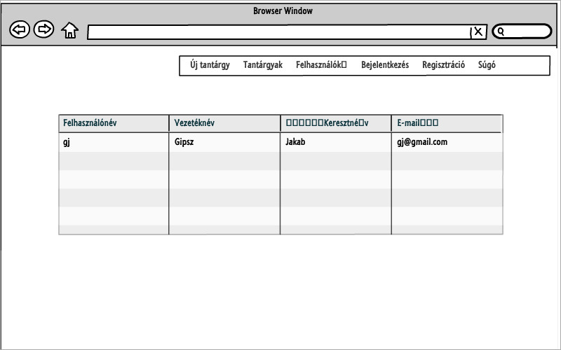
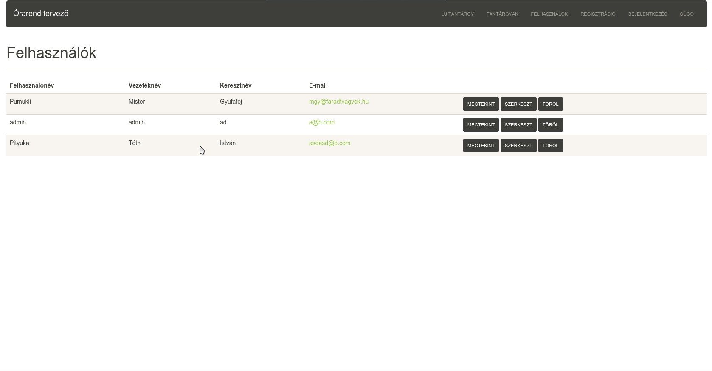
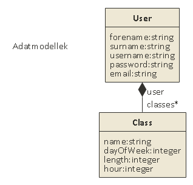
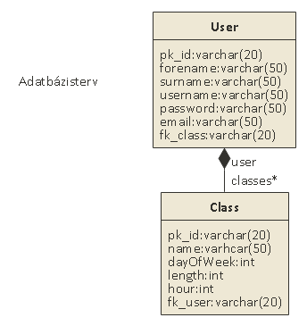
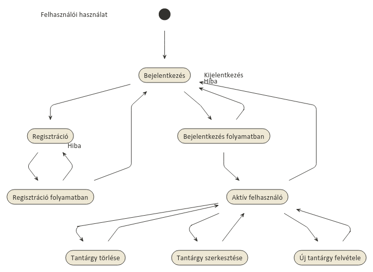

# Követelményanalízis

## Funkcionális követelmények

- Vendégként regisztrálni.
- Felhasználóként szeretnék tantárgyakat felvenni, módosítani, törölni.
- Operátorként szeretném a felhasználókat törölni, módosítani.

## Nem funkcionális követelmények

- Felhasználóbarát ergonomikus elrendezés és kinézet
- Biztonságos működés: jelszavak tárolása, funkciókhoz való hozzáférés
- Gyors

## Használatieset-modell

-  Vendég: A főoldal tartalmához hozzáfér.
-  Felhasználó: Vengég szerepkörén túl, tantárgyakat vehet fel.
-  Operátor: Receptszerkesztő szerepkörén túl, törölheti bárkit.

## Használati eset diagramok:

## Folyamatok pontos menete:

# Tervezés

### Oldaltérkép

Publikus:

- Főoldal
- Súgó
- Bejelentkező felület
- Regisztrációs felület
 
Recept szerkesztő:

- Tantárgyak
    + új tantárgy
    + (saját)tantárgy szerkesztése
    + (saját)tantárgy törlése
        
Operátor:
- felhasználók listázása
- felhasználók törlése

### Végpontok

| Kérés| Útvonal           | Leírás                                           |
|------|-------------------|--------------------------------------------------|
| GET  | /                 | főoldal                                          |
| GET  | /about            | leírás a használatról                            |
| GET  | /users/signin     | bejelentkező oldal                               |
| GET  | /users/signup     | regisztrációs oldal                              |
| GET  | /users/edit/:id   | felhasználó szerkesztése                         |
| GET  | /users/list       | felhasználók listázása                           |
| GET  | /classes/list     | tantárgyak listázása(összes)                     |
| GET  | /classes/new      | új tantárgy felvitele                            |
| GET  | /classes/edit     | tantárgy adatainak szerkesztése                  |

## Felhasználóifelület-modell

### Oldalvázlatok

### Designterv

### Adatmodell

### Adatbázisterv

### Állapotdiagram

# Implementáció

##Fejlesztői környezet bemutatása

###Könyvtárstruktúrában lévő mappák és fájlok funkiójának bemutatása:
orarend/app könyvtáron belül

| Útvonal                  | Leírás                                            |
|--------------------------|----------------------------------------------------------------------------------------|
| /config                  | konfigurációs állományok helye   |
| /pods/components         | Ember js komponesek       |
| /pods/components         | Ember js komponesek       |

# Felhasználói dokumentáció

## A futtatáshoz ajánlott hardver-, szoftver konfiguráció

###Server oldalon: 

- Op. rendszer: Windows/Linux...(Linux ajánlott)
- NodeJS

###Kliens oldalon: 
- Chrome
- Firefox
- Internet Explorer 11 >
- Opera
- egyéb HTML5, CSS3 -at megjelenítő, Javascriptet futtató böngésző

##Telepítés lépései

###Linux-on

####Következő csomagok(programok) szükségesek: `nodejs, bower`

`cd /installation/path`

`git clone https://github.com/akooos/af_bead3.git`

`npm install ember-cli –-save`

`bower install`

## A program használata
Az előbbiekben ajánlott böngésző valamelyikével a célgép címére kell navigálni.

## Futtatás

* `ember server`

### Tesztelés

* `ember test`
* `ember test --server`

### Építés

* `ember build` (development)
* `ember build --environment production` (production)
